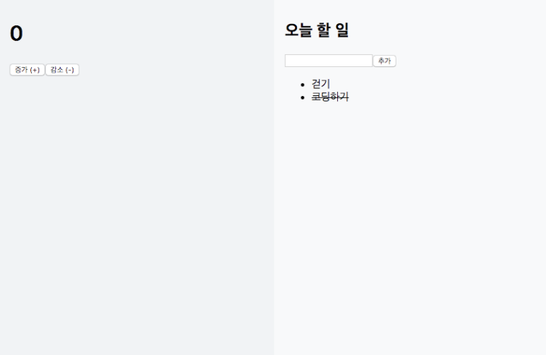

# Counter + Todo Example

- 패키지 설치
- 컴포넌트 구성
- 액션생성함수를 미리 bind 하기
- Screenshot

---

## 패키지 설치

- redux
- react-redux
- redux-actions
- immutable

---

## 컴포넌트 구성

- AppTemplate : 두가지 화면을 화면에 레이아웃 해주는 컴포넌트
- Counter : 카운터의 뷰를 보여주는 컴포넌트
- Todos : 투두리스트의 뷰를 보여주는 컴포넌트

---

## 액션생성함수를 미리 bind 하기

```javascript
// src/store/actionCreators.js
import { bindActionCreators } from 'redux';
import * as counterActions from './modules/counter';
import * as todoActions from './modules/todo';

import store from './index';

const { dispatch } = store;

export const CounterActions = bindActionCreators(counterActions, dispatch);
export const TodoActions = bindActionCreators(todoActions, dispatch);
```

---

## Screenshot

</img>
