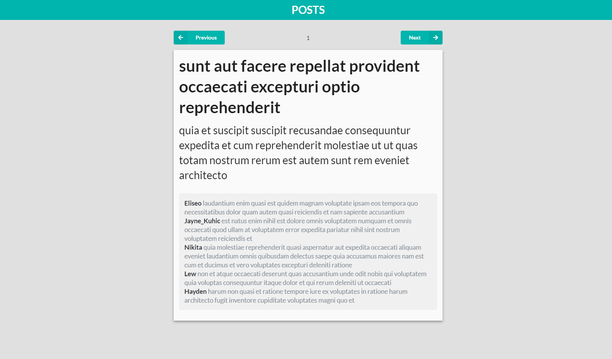

# Posts Example

- 프로젝트 준비
- 컴포넌트 구성
- 구형 브라우저 지원하기
- 빌드하고 surge.sh 에 deploy 하기

---

## 프로젝트 준비

- Node Js
- React JS
- Axios : Node.js를 위한 Promise API를 활용하는 HTTP 비동기 통신 라이브러리
- Semantic-UI

### 1. 의존 모듈 설치

- axios
- [smantic-ui](https://react.semantic-ui.com/)

`npm install --save axios semantic-ui-react semantic-ui-css`

### 2. 사용한 API

- [JSONPlaceholder](https://jsonplaceholder.typicode.com/)

---

## 컴포넌트 구성

- 똑똑한 컴포넌트 `container` : 멍청한 컴포넌트들을 관리한다. state 를 지닐 수 있고, 작업을 프로세싱 할 수 있다.
- 멍청한 컴포넌트 `components` : 오직, props 로 전달받은 값을 렌더링한다.

---

## 구형 브라우저 지원하기

axios는 Promise를 사용하는 HTTP Client 라이브러리이다.
Promise는 신형 브라우저에만 내장되어 있기 때문에, polyfill을 통해 호환해주어야 한다.

`npm install --save promise-polyfill`

```javascript
// src/index.js에 코드 삽입
import Promise from 'promise-polyfill';

if (!window.Promise) {
  window.Promise = Promise;
}

ReactDOM.render(<App />, document.getElementById('root'));
```

---

## 빌드하고 surge.sh 에 deploy 하기

Surge.sh 를 사용하면 html, css, js 등의 정적 파일들을 무료로 퍼블리시하고, 서브도메인 & SSL 을 받을 수 있다.

### 1. React 프로젝트 빌드하기

`npm run build`

### 2. surge 글로벌 설치

`npm install -g surge`

설치 후 build 경로로 이동해 `surge` 명령어를 입력하면 된다.

---

## Screenshot

</img>
