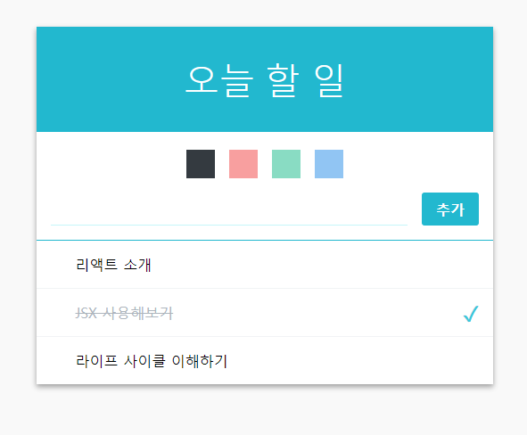

# Todo Example

- 프로젝트 준비
- 컴포넌트 구성
- 컴포넌트 최적화
- 팔레트 기능 구현하기
- Screenshot

---

## 프로젝트 준비

- Node Js
- React JS

---

## 컴포넌트 구성

- Form : 할일을 추가하기 위한 컴포넌트
- TodoItem : 특정 할일에 대한 정보를 보여주는 컴포넌트
- TodoItemList : TodoItem 의 리스트를 보관하고 있는 컴포넌트
- TodoListTemplate : template 형태로 제작
- TodoFinal : smart 컴포넌트로 전체적인 컴포넌트 관리

---

## 컴포넌트 최적화

```javascript
 shouldComponentUpdate(nextProps, nextState) {
    return this.props.todos !== nextProps.todos;
  }
```

---

## 팔레트 기능 구현하기

```javascript
import React from 'react';
import './Palette.css';

const Color = ({ color, active, onClick }) => {
  return <div className={`color ${active && 'active'}`} style={{ background: color }} onClick={onClick}></div>;
};

const Palette = ({ colors, selected, onSelect }) => {
  const colorList = colors.map((color) => <Color color={color} active={selected === color} onClick={() => onSelect(color)} key={color} />);
  return <div className="palette">{colorList}</div>;
};

export default Palette;
```

---

## Screenshot

</img>
